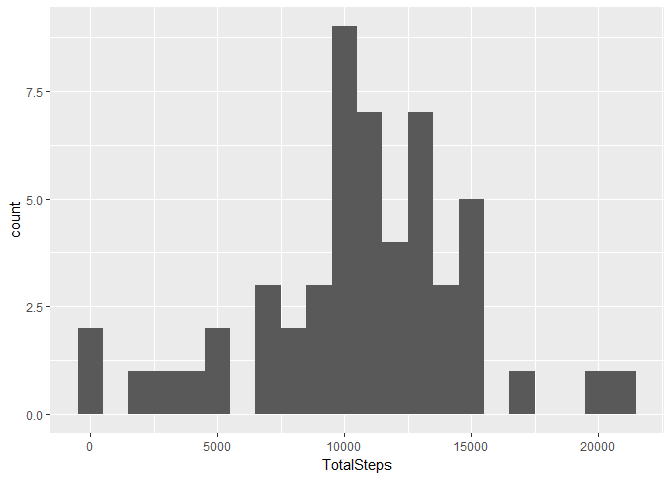
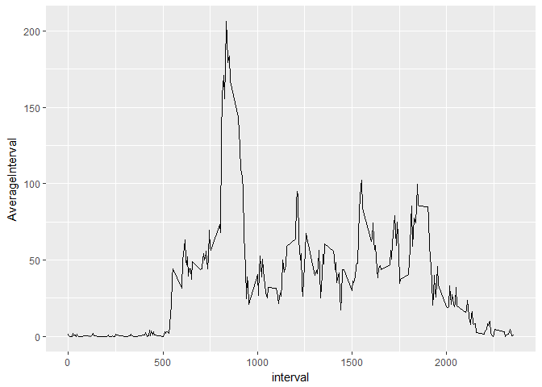
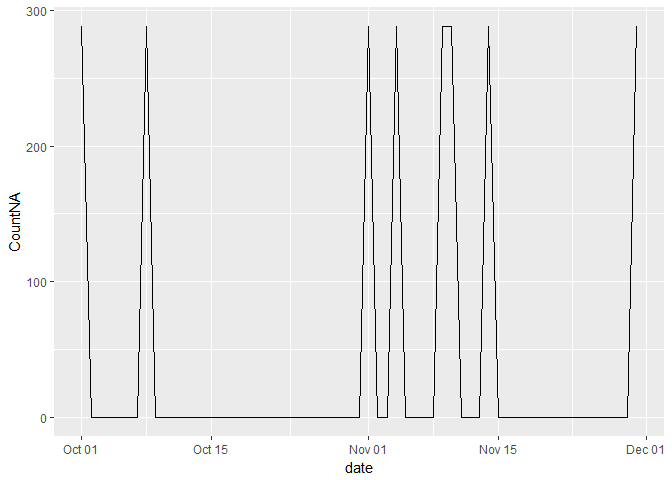
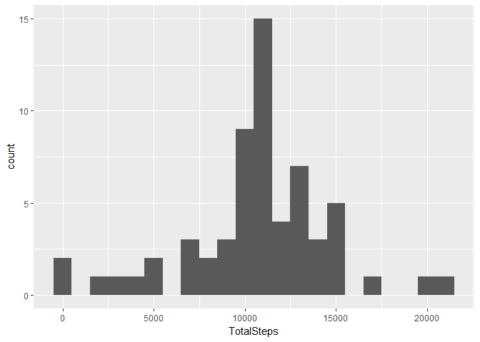
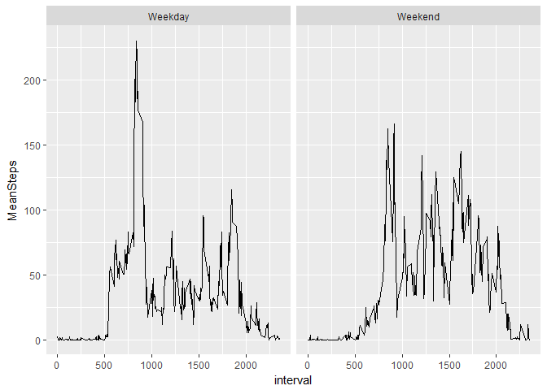

# Activity Exploration
Jasper  
September 17, 2017  


## Getting Data

First off, we have to get the data which is given to us in the repository.
Using `read.csv()` we get a all information in a data frame, and we can use the `lubridate` package to convert the text dates into actual dates.

```r
    unzip("activity.zip")
    Activities<-read.csv("activity.csv",header=TRUE,na.strings = "NA")
    Activities$date<-ymd(Activities$date)
    CleanedActivities<-filter(Activities,!is.na(steps))
```

The data is now tidy: each row is an observation, and each column is either a value or a description for the observation. It is time to continue the analysis.

## Total number of steps per day


```r
    Days<- CleanedActivities%>%
        group_by(date)%>%
        summarize(TotalSteps=sum(steps))
    ggplot(Days,aes(TotalSteps))+geom_histogram(binwidth = 1000)
```

<!-- -->

```r
    # mean <- mean(Days$TotalSteps)
    # median<- median(Days$TotalSteps)
```
The mean number of steps per day is 1.0766189\times 10^{4} and the median number is 10765. 

## Daily activity pattern
We use `ggplot` to get the time series for steps per interval.

```r
    AverageDay<-CleanedActivities%>%
        group_by(interval)%>%
        summarize(AverageInterval=mean(steps,na.remove=TRUE))
    ggplot(AverageDay,aes(interval,AverageInterval))+geom_line()
```

<!-- -->

##Imputing missing values
We look at how  missing values were distributed in the original dataset.

```r
    DayNA<- Activities %>%
        group_by(date)%>%
        summarize(CountNA=sum(is.na(steps)))
        ggplot(DayNA,aes(date,CountNA))+geom_line()
```

<!-- -->
We see that the only time values are missing, they are missing for a whole day. This happens for 8 days in the period. We will replace each of these days with the average day. 
First, we define a function which takes `steps` and either leaves it, or if missing replaces it by the average value for that interval.
Then, we use sapply on the whole dataset.

```r
    FillSteps<-function(steps,TimeInterval){
        Filler<-NA
        if(!is.na(steps)) Filler<-steps
        else Filler<-AverageDay[AverageDay$interval==TimeInterval,]$AverageInterval
        return(Filler)
    }
    FilledActivities<-Activities
    FilledActivities$steps<-mapply(FillSteps,FilledActivities$steps,FilledActivities$interval)
```
Making the histogram again, we find:

```r
    FilledDays<- FilledActivities%>%
        group_by(date)%>%
        summarize(TotalSteps=sum(steps))
    ggplot(FilledDays,aes(TotalSteps))+geom_histogram(binwidth = 1000)
```

<!-- -->

```r
    # mean <- mean(Days$TotalSteps)
    # median<- median(Days$TotalSteps)
```
The mean number of steps per day is 1.0766189\times 10^{4} and the median number is 1.0766189\times 10^{4}. 

## Differences in activity pattern 
To see the difference in activity pattern we create a dummy variable (using `mutate()`) on the dataset with missing values imputed. Using `group` to find patterns we get to the following graph.

```r
    WeekPattern<-FilledActivities %>%
        mutate(Weekday=(wday(date) %in% c(1,7)))
    WeekPattern<-mutate(WeekPattern,Weekend=ifelse(Weekday,"Weekend","Weekday"))%>%
        group_by(Weekend,interval)%>%
        summarize(MeanSteps=mean(steps))
        ggplot(WeekPattern,aes(x=interval,y=MeanSteps))+geom_line()+facet_wrap(~Weekend)
```

<!-- -->

We see clear differences in patterns between weekdays and weekends.


